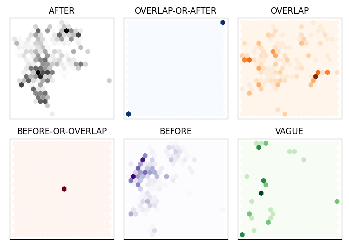

Author: Lis Kanashiro Pereira

## ALICE

Alice is an adversarial training method built on top of the mtdnn framework: https://github.com/namisan/mt-dnn . Please check how to use it first. 

### BERT and Transformers' models

Recommended references:

1) BERT paper: https://aclanthology.org/N19-1423.pdf

2) Huggingface: https://huggingface.co/docs/transformers/model_doc/bert

3) Natural Language Processing with Transformers book: https://transformersbook.com/

## Quick start

We provide a quick example on how to run it on an English temporal task (MC-TACO), and on a Japanese temporal task, the BCCWJ-TimeBank (DCT) Task.

The examples were ran on the DGX-1 machine. 

## Environment Setup

1) First, download the ALICE package from alice/mt-dnn-alice folder.

2) Download the BCCWJ-dataset from the DGX-1 data folder: 

```>/data/lis/datasets/bccwj_dataset```

3) Download the MC-TACO from the DGX-1 data folder: 

```>/data/lis/datasets/mctaco_dataset```

4) Download the Japanese BERT model from `the DGX-1 data folder: 

    ```>/data/lis/japanese_bert``` 
    
    and place it inside the alice/mt-dnn-alice folder.
    
5) Download the English RoBERTa model from `the DGX-1 data folder: 

    ```>/data/lis/roberta/roberta``` 
    
    ```>/data/lis/roberta/roberta.base```
    
    ```>/data/lis/roberta/roberta.large```
    
    and place it inside the alice/mt-dnn-alice folder.

6) Pull docker: 

    ```>docker pull allenlao/pytorch-mt-dnn:v0.5```

7) Set the environment variables:

    ```>IMAGE=allenlao/pytorch-mt-dnn:v0.5```
    
    ```>V_DIR=your_alice_directory_path```

8) Run docker:

    ```>docker run --runtime=nvidia --device=/dev/nvidia0  --device=/dev/nvidia1 --device=/dev/nvidia2 --device=/dev/nvidia3 --device=/dev/nvidia4 --device=/dev/nvidia5 --device=/dev/nvidia6 --device=/dev/nvidia7  -it  --rm --name mt_dnn --net host --volume $V_DIR:/home/your_home_folder_name/temp  --interactive --tty $IMAGE /bin/bash```

9) Go to the project folder:
    
    ```>cd /home/your_home_folder_name/temp/mt-dnn-alice```
    
10) Example:

    I give an example with the above commands for my user on the DGX-1 machine. My username is "lis", so the commands will look like the following:
    
    ```>V_DIR=alice```
    
    ```>docker run --runtime=nvidia --device=/dev/nvidia0  --device=/dev/nvidia1 --device=/dev/nvidia2 --device=/dev/nvidia3 --device=/dev/nvidia4 --device=/dev/nvidia5 --device=/dev/nvidia6 --device=/dev/nvidia7  -it  --rm --name alice --net host --volume $V_DIR:/home/lis/temp  --interactive --tty $IMAGE /bin/bash```

    ```>cd /home/lis/temp/mt-dnn-alice```
    
## Data Pre-processing

1) MC-TACO

To pre-process the dataset, run the following command:

```>python prepro_std.py --model roberta --roberta_path roberta  --root_dir mctaco_dataset/ --task_def experiments/mctaco/mctaco_task_def.yml --do_lower_case $1```


2) BCCWJ-Timebank

For this dataset, we perform 5-fold cross-validation, so we need to pre-process all the 5 data folders.

To pre-process the dataset, run the following command:

```>python prepro_japanese.py --model japanese_bert/  --root_dir bccwj_dataset/DCT/0 --task_def experiments/bccwj/dct_task_def.yml --do_lower_case $1```

```>python prepro_japanese.py --model japanese_bert/  --root_dir bccwj_dataset/DCT/1 --task_def experiments/bccwj/dct_task_def.yml --do_lower_case $1```

```>python prepro_japanese.py --model japanese_bert/  --root_dir bccwj_dataset/DCT/2 --task_def experiments/bccwj/dct_task_def.yml --do_lower_case $1```

```>python prepro_japanese.py --model japanese_bert/ --root_dir bccwj_dataset/DCT/3 --task_def experiments/bccwj/dct_task_def.yml --do_lower_case $1```

```>python prepro_japanese.py --model japanese_bert/  --root_dir bccwj_dataset/DCT/4 --task_def experiments/bccwj/dct_task_def.yml --do_lower_case $1```


## Training with ALICE

We provide running scripts for 2 settings: standard fine-tuning, and ALICE.

### Training on MC-TACO

1) Standard fine-tuning: 

    please go to the mctaco scripts folder: 
    
    ```>cd scripts/mctaco```
    
    run the training script:
    
    ```>sh run_mctaco.sh```
    
2) ALICE:
 
    --------------------------------------------

    Running ALICE on RoBERTa_BASE model

    --------------------------------------------

    please go to the mctaco_alice_roberta_base scripts folder: 
    
    ```>cd scripts/mctaco_alice_roberta_base```
    
    run the training script:
    
    ```>sh run_mctaco.sh```

    --------------------------------------------

    Running ALICE on RoBERTa_LARGE model

    --------------------------------------------

    please go to the mctaco_alice_roberta_large scripts folder:

    ```>cd scripts/mctaco_alice_roberta_large```

    run the training script:

    ```>sh run_mctaco.sh```

After training, we obtain the following results: 

	Standard fine-tuning (RoBERTa_BASE) ->  F1-Score:  86.04

               ALICE (RoBERTa_BASE) ->  F1-Score:  88.09

               ALICE (RoBERTa_LARGE) -> F1-Score: 90.22

### Training on BCCWJ-Timebank

1) Standard fine-tuning: 

    please go to the bccwj scripts folder: 
    
    ```>cd scripts/bccwj```
    
    run the training script for each task. For example, for the DCT task, please run:
    
    ```>sh run_dct.sh```
    
2) ALICE:

    please go to the bccwj_alice scripts folder: 
    
    ```>cd scripts/bccwj_alice```
    
    run the training script for each task. For example, for the DCT task, please run:
    
    ```>sh run_dct.sh```


After running 5-fold cross-validation, we obtain the following results (average score of all folds): 

	Standard fine-tuning  ->   ACC: 65.85
         
               ALICE ->   ACC: 68.59
     
### To extract the final hidden states after training the model

You can run the following code on your local machine (no need to use docker).

In this example, we visualize the final hidden states of the bert model after fine-tuning it on the bccwj dataset.

When we fine-tune a model on a dataset, the model weights are saved at the checkpoints folder located in the same folder as the .sh script you run. 

First, we need to remove the top layer of the model. To do that, please run:

python strip.py --checkpoint your_fine_tuned_model_path --fout your_output_model_path

I placed a top layer removed model inside the data/lis/alice_models folder. The file name is dct_alice_top_removed.pt. Please copy and place this model file inside the alice/mt-dnn-alice folder.

Go to the alice folder, and run the following command:

python plot.py --checkpoint mt-dnn-alice/dct_alice_top_removed.pt --train_data mt-dnn-alice/bccwj_dataset/DCT/0/dct_train.tsv 

After running the script, you should be able to visualize a figure such as the one below:



 

## Citation
See the following paper:

Lis Kanashiro Pereira, Xiaodong Liu, Fei Cheng, Masayuki Asahara, Ichiro Kobayashi. Adversarial Training for Commonsense Inference. ACL2020 RepL4NLP. Arxiv version: https://arxiv.org/abs/2005.08156
